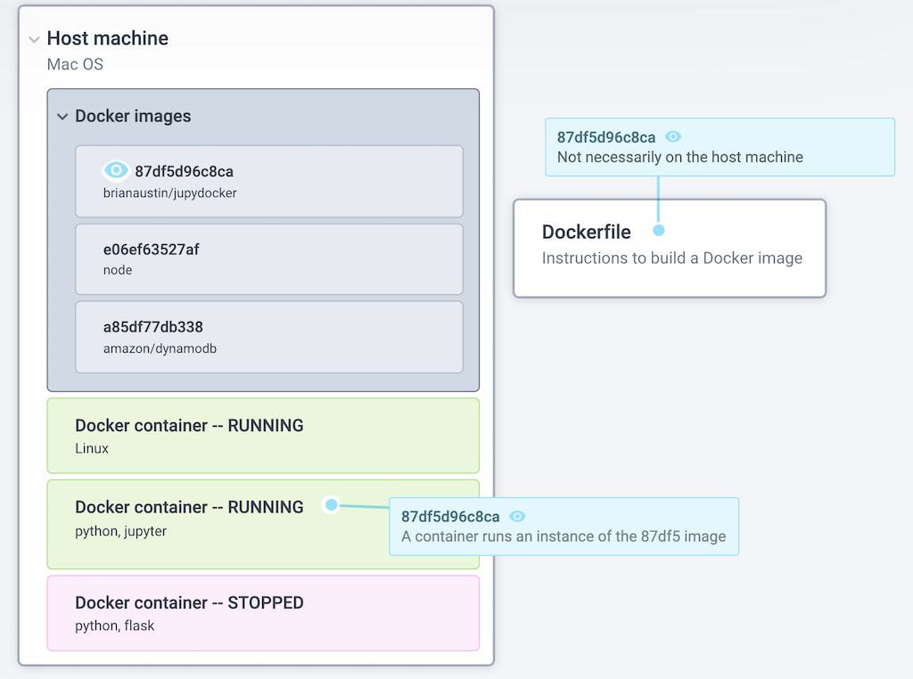

# How and why to put your Jupyter notebooks in Docker containers

## Contents
1. Some quick uses of Jupyter notebooks
2. Drawbacks of Jupyter
3. Brief overview of Docker
4. Walkthrough of using a Dockerfile to embed Jupyter notebook in a Docker container
5. Sharing a Docker container with an audience via Docker Hub

A talk by Brian Austin
